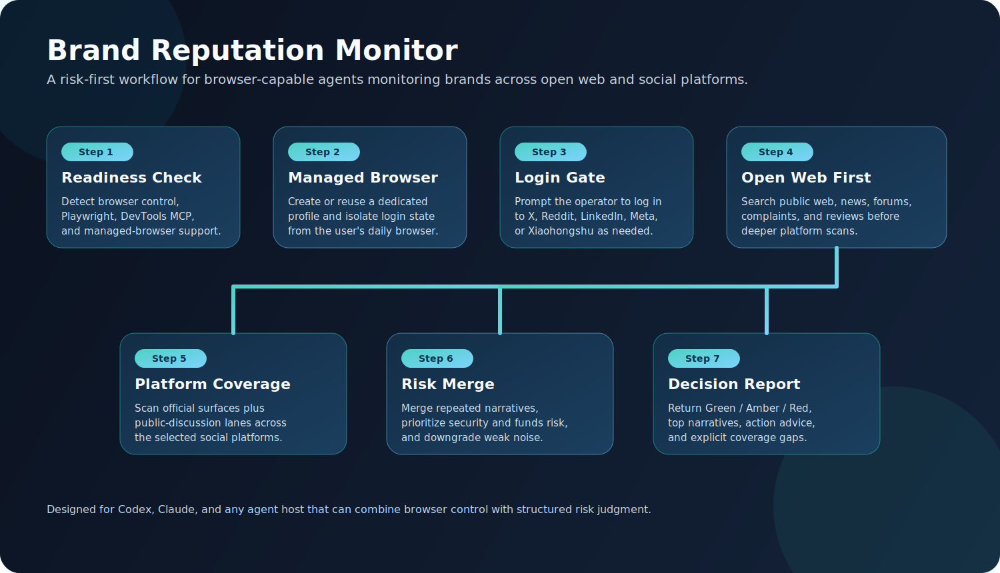

# Brand Reputation Monitor Skill

[中文说明](README.zh-CN.md) · [Install Guide](docs/INSTALL.md) · [安装说明](docs/INSTALL.zh-CN.md)



Turn a browser-capable agent into a cross-platform brand reputation, PR-risk, and crisis-signal monitor.

This project packages a reusable, host-agnostic monitoring skill that can be used in Codex, Claude, or other agent hosts with browser control. It is designed for one-pass scans and recurring monitoring runs where the agent must:

- infer the brand's sector and likely complaint vectors
- always cover open web / public search first
- scan selected social platforms such as X, Reddit, Facebook, LinkedIn, Instagram, and Xiaohongshu
- prioritize security, funds, fraud, phishing, outage, legal, and trust-risk signals
- check browser readiness first, then create or reuse a dedicated managed browser
- remind the operator to log into requested social platforms in that managed browser before relying on gated coverage

## Why This Exists

Brand monitoring prompts often break in practice for three reasons:

1. They treat social monitoring as generic sentiment collection instead of risk detection.
2. They ignore browser readiness and login state, then pretend platform coverage is complete.
3. They are tied to one host or one repo instead of being portable across agents.

This project fixes those failure modes by shipping a monitoring workflow that is:

- risk-first
- browser-aware
- login-aware
- host-agnostic
- automation-friendly

## What The Skill Does

The skill activates for natural-language requests such as:

- monitor this brand
- check whether there is a PR problem
- scan X and Reddit for crisis signals
- look for security complaints about this company
- run a brand reputation scan for the last 72 hours

On each run, it is expected to:

1. Verify browser readiness.
2. Install or configure browser tooling when the host allows local setup.
3. Create or reuse a dedicated managed browser profile.
4. Ask the user to log into requested platforms in that managed browser.
5. Always scan open web coverage first.
6. Scan requested social platforms.
7. Merge repeated narratives across sources.
8. Return a concise decision-oriented report.

## Default Monitoring Logic

- Default time window: last 72 hours
- Default mandatory coverage: open web / public search results
- Default high-priority topics:
  - security incidents
  - funds loss or withdrawal failure
  - fraud, phishing, impersonation
  - privacy breach or data leak
  - outages that damage trust
  - repeated customer-harm complaints
  - media or influencer amplification

## Output Shape

The recommended report format is:

1. Monitoring scope
2. Overall status: `Green`, `Amber`, or `Red`
3. Key conclusions
4. Security / trust / funds risk section
5. Top narratives or posts
6. Recommended action
7. Coverage gaps

The skill is intentionally conservative about inaccessible platforms. If a requested platform is not logged in or not fully accessible, the run should continue and explicitly mark coverage as partial.

## Repository Layout

```text
brand-reputation-monitor-skill/
├── README.md
├── README.zh-CN.md
├── LICENSE
├── assets/
│   └── workflow-overview.svg
├── docs/
│   ├── INSTALL.md
│   └── INSTALL.zh-CN.md
├── scripts/
│   ├── install-codex-skill.ps1
│   └── install-codex-skill.sh
└── skill/
    ├── SKILL.md
    ├── agents/openai.yaml
    ├── scripts/
    └── references/
```

## Quick Start

### Codex

1. Copy or install the `skill/` folder into your Codex skills directory.
2. Ensure the host can use browser automation and browser-native control.
3. Ask Codex to run the scan, for example:

```text
Use $brand-reputation-monitor to run one reputation scan for BYDFi across X, Reddit, LinkedIn, and open web within the last 72 hours.
```

### Claude

If your Claude host supports reusable skills, copy the `skill/` folder into the equivalent skills location.

If it does not, use the prompt templates directly:

- [Claude minimal entry](skill/references/claude-minimal-entry.md)
- [Portable one-pass prompt](skill/references/portable-prompt-template.md)
- [Automation prompt](skill/references/automation-prompt-template.md)

## Installation

Manual and script-based setup steps are documented here:

- [Install Guide](docs/INSTALL.md)
- [安装说明](docs/INSTALL.zh-CN.md)

## Optional Telegram Alerts

This skill can optionally notify the operator through Telegram when the final
risk meets or exceeds a configured threshold.

To enable this safely, the user must provide:

- `TELEGRAM_BOT_TOKEN`
- `TELEGRAM_CHAT_ID`

Recommended default:

- send alerts on `Amber` and `Red`
- also send immediately for high-priority security or funds-risk overrides

On Windows Codex-like hosts, the bundled helper is:

- [send-telegram-alert.py](skill/scripts/send-telegram-alert.py)

## Managed Browser And Login Expectations

This project intentionally assumes that social-platform coverage is only trustworthy when the designated managed browser already has the required login state.

For example:

- if X is requested, the managed browser should be logged into X
- if LinkedIn is requested, the managed browser should be logged into LinkedIn
- if Xiaohongshu is requested, the managed browser should be logged into Xiaohongshu

If a platform is not logged in, the skill should not fake complete coverage.

## Tooling Expectations

When the host allows local setup, the skill is designed to help bootstrap:

- Playwright or an equivalent browser automation layer
- Chrome DevTools MCP or an equivalent browser-native control layer
- a dedicated managed browser profile for monitoring work

Exact package names and installation mechanics depend on the host. In Codex-like environments, common equivalents are:

- `chrome-devtools-mcp`
- `@playwright/mcp`

## Limitations

- This is a workflow package, not a hosted SaaS product.
- Quality depends on the host's browser access, shell permissions, and platform visibility.
- Private or heavily gated content may remain unavailable even after login.
- The skill is designed for risk detection, not sentiment dashboards or historical analytics.

## License

This repository is released under the [MIT License](LICENSE).
